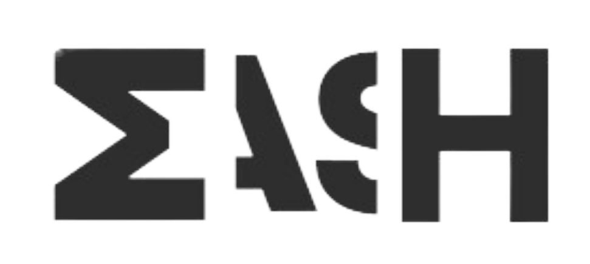

<a name="readme-top">

<br/>

<br />
<div align="center">
  <a href="https://github.com/yram-nna12/">
  <!-- TODO: If you want to add logo or banner you can add it here -->
    
  </a>
<!-- TODO: Change Title to the name of the title of your Project -->
  <h3 align="center">Final Activity :  A Showcase of Design and Functionality</h3>
</div>
<!-- TODO: Make a short description -->
<div align="center">
This website functions as an extensive portfolio showcasing creativity and technical skill, with features ranging from a resume-like summary outlining credentials and experience to a specific project display with repository links.
</div>

<br />

<!-- TODO: Change the zyx-0314 into your github username  -->
<!-- TODO: Change the WD-Template-Project into the same name of your folder -->


<br />

<!-- TODO: If you want to add more layers for your readme -->
<details>
  <summary>Table of Contents</summary>
  <ol>
    <li>
      <a href="#overview">Overview</a>
      <ol>
        <li>
          <a href="#key-components">Key Components</a>
        </li>
        <li>
          <a href="#technology">Technology</a>
        </li>
      </ol>
    </li>
    <li>
      <a href="#resources">Resources</a>
      <li>
      <a href="#Instruction">Instructions</a>
    </li>
    <li>
      <a href="#File Structure">File Structure</a>
    </li>
    <li>
      <a href="#Deployment Instructions">Deployment Instructions</a>
    </li>
    <li>
      <a href="#Resources">Resources</a>
    </li>
    <li>
      <a href="#My Projects">My Projects</a>
    </li>
    <li>
      <a href="# WakaTime Integration">WakaTime Integration</a>
      <ol>
        <li>
          <a href="#Coding Acitivity">Coding Acitivity</a>
        </li>
        <li>
          <a href="#Languages">Languages</a>
        </li>
      </ol>
    </li>
    </li>
  </ol>
</details>
---

## Overview

<!-- TODO: To be changed -->
<!-- The following are just sample -->
Introducing my v.2 personal website, a carefully constructed digital portfolio that reflects my passion for web design and programming. This project is an integration of HTML, CSS, and JavaScript expertise; it provides a tour across many websites intended to showcase both technical mastery and artistic vision. Every page is carefully designed to offer users a smooth navigation experience and simple access to information that resembles a résumé and describes my experience, education, and talents.This website's main feature is a dedicated project exhibition, where I gladly provide a hand-picked collection of previous work. Every project entry showcases my ability to create reliable online apps and includes a thorough explanation, links to repositories, and information about the technologies used. The website's design philosophy highlights simple aesthetics and user-friendly interfaces, highlighting my dedication to creating outstanding digital experiences.

This website is not just a demonstration of technical skills, but also of creativity and uniqueness in web building. Every component of my project, from captivating visual layouts to responsive design features, tries to fascinate and educate visitors about my talents and accomplishments. This personal website aims to make a lasting impression, encouraging you to explore the junction of design brilliance and practical elegance, whether you're looking through my portfolio or learning more about my professional experience.

Technologically, the project leverages HTML for structuring content, CSS for styling to ensure aesthetic appeal and responsiveness across devices, and JavaScript for enhancing user interactions such as dynamic content loading or animations. The use of media queries ensures that the webpage adapts seamlessly to different screen sizes, optimizing usability and engagement.

### Key Components
<!-- TODO: List of Key Components -->
<!-- The following are just sample -->
- MultiPage Website
- Parallax transition
- Responsive Navigations
- Resume-like Information
- Project Showcase
- Responsive and Accessible Design
- Distinct Design Layouts

### Technology
<!-- TODO: List of Technology Used -->


### Instruction

1. Navigation: Start by using the top navigation menu, located at the header. It features links to different sections of the website, including "Home," "About," "Projects," etc. Click on any of these links to navigate directly to the respective pages.

2. Exploring Pages: 
- Home: Begin your journey here to get an overview of the website's purpose and key sections.
- About: Learn more about me, my background, skills, and interests. Scroll through the page or use the navigation buttons to explore different sections.
- Projects: Dive into a showcase of my past projects. Each project entry includes a brief description, links to repositories, and details on technologies used. Click on project titles or images to view more.
- Resume: Access a detailed summary of my skills, qualifications, and professional experience. Navigate through different sections to get a comprehensive view.
- Contact: Connect with me through various social media platforms or via email. Use the provided contact form to send a message directly.

3. Interactive: 
- Project Showcase: Interact with project entries to explore detailed descriptions and technical insights.
- Navigation Buttons: Use buttons strategically placed throughout the website for seamless navigation between sections and pages.
- Social Media Links: Connect with me on social media platforms by clicking on the icons located in the footer section of each page.

4. Accessibility: The website is designed to be responsive, ensuring optimal viewing across devices of different screen sizes. Enjoy a consistent and user-friendly experience whether you're using a desktop, tablet, or mobile phone.

5. Feedback and Contact:
Your feedback is valuable! If you have any questions, suggestions, or would like to discuss potential collaborations, feel free to reach out via the contact form or social media links provided. I look forward to hearing from you!

### File Structure


```

WD-Final-Project
└─ assets
|   └─ css
|   |   └─ style.css
|   └─ img
|   |   └─ bgmain.jpg
|   |   └─ bgmain2.jpg
|   |   └─ logoforheader.png
|   └─ js
|       └─ script.js
└─ pages
|  └─ about-me
|  |  └─ assets
|  |  |  └─ css
|  |  |  |  └─ style.css
|  |  |  └─ img
|  |  |  |  └─ bgmain.jpg
|  |  |  |  └─ bgmain2.jpg
|  |  |  |  └─ logoforheader.png
|  |  |  └─ js
|  |  |     └─ script.js
|  |  └─ index.html
|  └─ contact
|  |  └─ assets
|  |  |  └─ css
|  |  |  |  └─ style.css
|  |  |  └─ img
|  |  |  |  └─ bgmain.jpg
|  |  |  |  └─ bgmain2.jpg
|  |  |  |  └─ logoforheader.png
|  |  |  └─ js
|  |  |     └─ script.js
|  |  └─ index.html
|  └─ credits
|  |  └─ assets
|  |  |  └─ css
|  |  |  |  └─ style.css
|  |  |  └─ img
|  |  |  |  └─ bgmain.jpg
|  |  |  |  └─ bgmain2.jpg
|  |  |  |  └─ logoforheader.png
|  |  |  └─ js
|  |  |     └─ script.js
|  |  └─ index.html
|  └─ feedback
|  |  └─ assets
|  |  |  └─ css
|  |  |  |  └─ style.css
|  |  |  └─ img
|  |  |  |  └─ bgmain.jpg
|  |  |  |  └─ bgmain2.jpg
|  |  |  |  └─ logoforheader.png
|  |  |  └─ js
|  |  |     └─ script.js
|  |  └─ index.html
|  └─ projects
|     └─ assets
|     |  └─ css
|     |  |  └─ style.css
|     |  └─ img
|     |  |  └─ bgmain.jpg
|     |  |  └─ bgmain2.jpg
|     |  |  └─ logoforheader.png
|     |  └─ js
|     |     └─ script.js
|     └─ index.html
└─ index.html
└─ README.md
```

### Deployment Instructions

To deploy this website, you have two options. First, clone the repository locally using Git, navigate to the project directory, and open the index.html file in your web browser to view the site. Alternatively, for online deployment, create a GitHub repository, push your code to GitHub, and enable GitHub Pages from your repository settings by selecting the main branch and root folder. Once deployed, your website will be accessible at the designated GitHub Pages URL. Ensure all links and functionalities are working correctly in the deployed version to provide a seamless user experience.


### My Projects
Explore my project repository: 
- [WD-Seatwork 2](https://github.com/yram-nna12/WD-Seatwork2.git)
- [WD-Hands On 2](https://github.com/yram-nna12/WD-Hands-On-2.git)
- [WD-Seatwork 3](https://github.com/yram-nna12/WD-Seatwork3.git)
- [WD-Seatwork 4](https://github.com/yram-nna12/WD-Seatwork-4.git)


## Resources
<!-- TODO: Add References -->
| Title | Purpose | Link |
|-|-|-|
| Font Awesome Free | Font & Icon Reference | [Link](https://cdnjs.cloudflare.com/ajax/libs/font-awesome/6.0.0-beta3/css/all.min.css) |
| Google | Reference for other Pictures | [Link](https://www.google.com/webhp?hl=en&sa=X&ved=0ahUKEwi0-Za1kIGHAxX_QfUHHfumBSIQPAgJ) |
| nicepage | Ideas for Page layout | [Link](https://nicepage.com/) |
| Appscript | for linking forms | [Link](https://script.google.com/home) |
| Pinterest |Reference for Page layout | [Link](https://ph.pinterest.com/) |


### WakaTime Integration
Track my coding activity on: 
[WakaTime](https://wakatime.com/@018f02f8-3e41-49f0-93c6-1b840df169b8)

### Coding Acitivity

<a href="https://wakatime.com"></a>

### Languages

<a href="https://wakatime.com"></a>